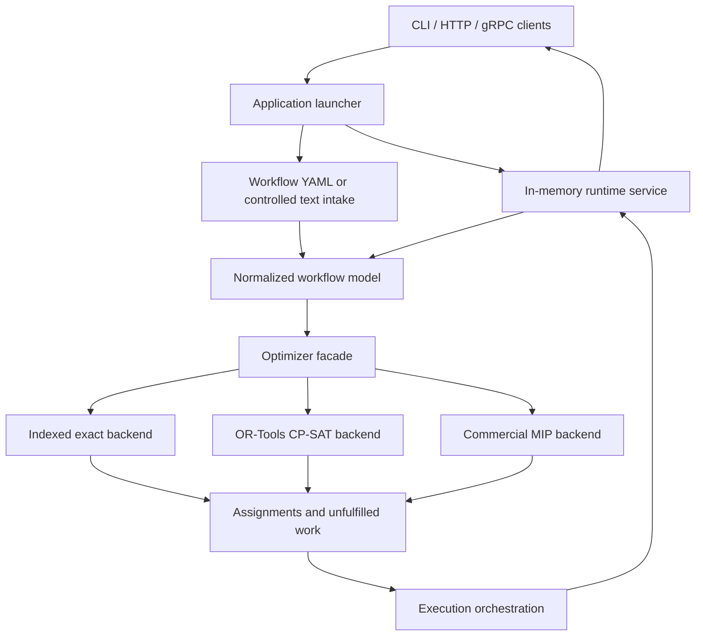

# Task Orchestrator Design

## Overview

Task Orchestrator is built for workflows where planning quality and runtime responsiveness both matter. A client describes actors, tasks, timing limits, dependencies, and preferences. The system converts that into a normalized planning problem, chooses a backend to optimize it, and then keeps the resulting workflow moving as runtime state changes.

This separation matters because global planning and live orchestration have different priorities. Planning is concerned with the whole problem: feasibility, deadlines, preferences, search quality, and solver behavior. Runtime orchestration is concerned with stability: accepting work, applying overrides, triggering replans at the right time, and exposing predictable interfaces to operators and upstream systems.

## High-level architecture

## How the system is organized

### Intake and normalization

The system accepts two input styles:

- structured YAML for stable machine-driven integrations
- a controlled natural-language format for deterministic text-driven requests

Both paths are converted into the same internal model. That gives the optimizer one consistent view of the world regardless of where the request came from.

The text path is intentionally narrow. It recognizes a controlled language rather than trying to interpret arbitrary prompts. That keeps failure modes visible and makes tests reliable. When freeform input is desirable, the recommended pattern is to use an external translator and still run the translated result through this deterministic layer.

### Optimization layer

Once the request has been normalized, the optimizer prepares the scheduling problem for one of the supported backends. The public interface is backend-agnostic, so the same model can be used for:

- the always-available internal indexed exact search
- an optional OR-Tools CP-SAT backend
- an optional commercial MIP backend

The internal model is richer than a simple task list. It carries actor eligibility, availability windows, priorities, deadlines, dependencies, mutual exclusions, execution cost, travel distance hints, and partial-plan controls. That keeps the planner side expressive enough for heavier external solvers without forcing a redesign of the application-facing API.

### Runtime orchestration layer

Planning produces assignments, but the runtime layer is responsible for keeping the workflow consistent after submission. It stores active workflows, applies task and actor overrides, exposes re-orchestration operations, and emits workflow events such as acceptance, replanning, planned tasks, and final run completion.

The runtime scheduler evaluates the same non-preemptive feasibility inputs that the optimizer layer sees. That includes actor-type and actor-id allow lists, required capabilities, demand versus capacity, release times, latest-start limits, deadlines, dependency chains, mutual exclusions, preferred actors, execution cost, and travel-distance hints. Internally it builds timed reservations from active work and planned assignments so a busy actor can still receive a future reservation when that is the earliest feasible choice.

The orchestrator only dispatches assignments whose planned start time has arrived and whose predecessor tasks have actually completed. This prevents speculative dependency violations, avoids duplicate dispatch of already-assigned work, and keeps runtime load accounting aligned with task demand instead of assuming every task consumes one unit of capacity.

This runtime layer is in-memory and transport-neutral. The application service owns workflow state and business behavior, while HTTP and gRPC act as adapters around the same service contract. Preemptible tasks remain outside the supported runtime model for now, so runtime planning fails closed if that constraint is requested.

### Transport and launcher layer

The executable in `application/` is a launcher rather than a one-shot demo. A structured application config can either run a single request or start a long-lived service. In service mode it can enable any combination of:

- local CLI interaction
- HTTP server
- gRPC server

The same config can also preload a bootstrap request when the service starts. Once launched, the process stays alive until interrupted or explicitly exited through the CLI.

The transport contract is defined in [task_orchestration.proto](protocol/proto/task_orchestration.proto) and [task_orchestration_service.proto](protocol/proto/task_orchestration_service.proto). Together they are the source of truth for:

- RPC names
- request and response messages
- runtime event messages
- HTTP route mapping

Unary RPCs return the final result, while gRPC server-streaming RPCs expose the intermediate `WorkflowEvent` sequence for clients that want acceptance, replanning, assignment, and completion events as they happen.

Code that only needs the interface can depend on the lightweight protocol target without linking the HTTP or gRPC implementations.

## Security model

Security is configured once and interpreted consistently across transports.

- Authentication can be disabled, bearer-token based, or API-key based.
- Secure transport can be required as part of request validation.
- TLS configuration uses a transport-agnostic model for certificates, private keys, trust roots, and peer verification.

HTTP and gRPC both load their concrete credentials from that shared configuration model. That keeps certificate provisioning, peer verification, and mutual-TLS policy consistent instead of duplicating security behavior in each transport.

## Backend strategy

The repo keeps a lightweight default path and a heavier optional path.

- The default build always includes the internal indexed backend.
- External solver backends are linked only in the optional-backend application and library targets.
- Backend choice remains a runtime config decision, but availability depends on which binary was built.

That arrangement keeps local development and CI self-contained while still allowing deployments to opt into stronger external solver engines when needed.

## Reliability and determinism

The design favors explicit behavior over implicit guesses.

- Structured YAML is the primary stable interface.
- Controlled text parsing fails closed on unrecognized input.
- Solver choice is explicit in config.
- Runtime re-orchestration is driven by concrete events and overrides.
- Tests are expected to assert exact assignments, workflow events, and timing behavior where practical.

This is especially important because the repository is intended to support replanning under changing actor and task state. Deterministic behavior makes those transitions understandable both in tests and in production operations.

## Repository structure

- `task_orchestrator/`
  - core workflow, scheduler, orchestrator, optimizer model, backend interfaces, and backends
- `application/`
  - YAML loading, runner, in-memory runtime service, and the launcher binary
- `protocol/`
  - protobuf schema, transport-neutral interfaces, HTTP transport, and gRPC transport
- `utils/`
  - shared infrastructure such as logging, generators, executors, and clocks

## Operational model

In practice, a typical request moves through the system like this:

1. A client submits workflow data through YAML, CLI text, HTTP, or gRPC.
2. The request is normalized into the internal workflow model.
3. The optimizer chooses the configured backend and produces assignments.
4. The runtime service stores the workflow state and returns results and events.
5. Later task or actor overrides can trigger a fresh planning pass without restarting the service.

That keeps the planning core reusable while still allowing the application binary to act as a long-running runtime endpoint for external systems.
